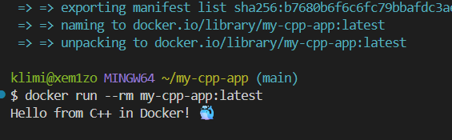

# my-cpp-app

Учебный проект с CI на GitHub Actions для C++-приложения.

## 📌 Цель работы

Настроить CI для C++-проекта: clang-format, сборка через CMake, Google Test, Docker.

## 🎯 Что делает CI

Три job'а:

1. **Format Code** — `clang-format` проверяет стиль `src/`
2. **Build & Test** — CMake + сборка + `ctest` (Google Test)
3. **Build Docker Image** — сборка образа + артефакт + тестовый запуск

## 📂 Структура проекта

```
my-cpp-app/
├── .github/
│   └── workflows/
│       └── ci.yml
├── src/
│   └── main.cpp
├── tests/
│   └── test.cpp
├── CMakeLists.txt
├── Dockerfile
├── .dockerignore
└── README.md
```

## 🟦 Основной код

**`src/main.cpp`:**
```cpp
#include <iostream>
#include <string>

std::string getGreeting() { return "Hello from C++ in Docker! 🐳"; }

int main() {
  std::cout << getGreeting() << std::endl;
  return 0;
}
```

## 🚀 Запуск локально

### Через Docker

```bash
docker build -t my-cpp-app:latest .
docker run --rm my-cpp-app:latest
```

Ожидаемый вывод:
```
Hello from C++ in Docker! 🐳
```

## 📸 Результат запуска



## ✅ Результат

При каждом push в `main` запускается CI.
На вкладке **Actions** отображаются 🟢 зелёные галочки.

**Ссылка на Actions:**  
https://github.com/xem1zo/my-cpp-app/actions

Дополнительно сохраняется артефакт `docker-image` (`.tar.gz`) на 7 дней.

## 📝 Вывод

В ходе работы я освоил:

- Настройку CI для C++-проектов в GitHub Actions
- Проверку форматирования через `clang-format`
- Сборку через CMake с опциональными тестами
- Unit-тестирование через Google Test и `ctest`
- Многоэтапную сборку Docker-образа
- Кэширование сборки через `type=gha`
- Сохранение Docker-образа как артефакта